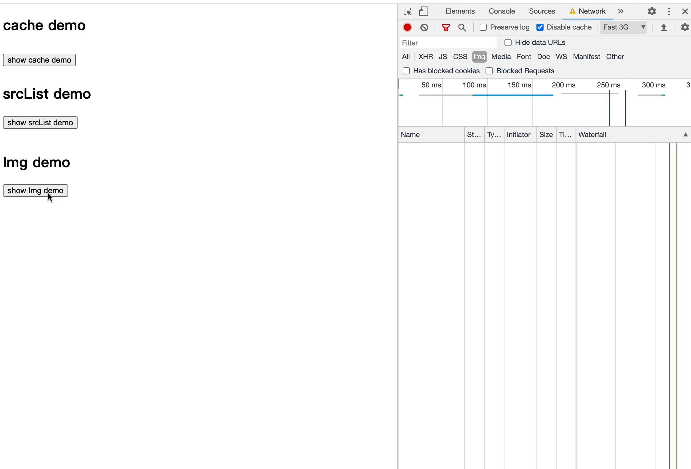
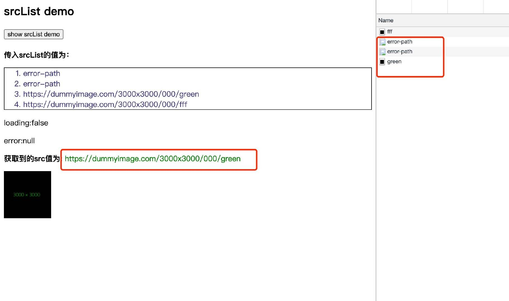

# UseImage_Component_React
 Write a useful 'UseImage' component in React
 <br/>




## Introduction

> `` can be said to be an extremely common tag in the development process。However, this has the following problems:

1. The picture loading is too slow. You need to display the 'loading' placeholder；
2. Failed to load pictures. Load alternate pictures or display 'error' placeholders。

<br/>

>  As developers, we may go through the following stages：

- Stage 1: use 'onload' and 'onerror' on the 'img' tag for processing；
- Stage 2: write a more general component；
- Stage 3: Pull away from 'hooks' and use the user-defined view components (of course, basic components should also be provided)；

Now let's start from the third stage and see how to use a small amount of code to create an 'image' component with good usability, encapsulation and scalability。

## Implementation  of 'useImage' 

First, analyze the reusable logic. It can be found that users need to pay attention to three states: `loading`, `error`, and `src`. After all, loading pictures is also an asynchronous request。

Customize a hooks, receive picture links as parameters, and return the three states required by the caller。

### Basic implementation

```ts
import * as React from 'react';

// Convert picture loading to promise call form
function imgPromise(src: string) {
  return new Promise((resolve, reject) => {
    const i = new Image();
    i.onload = () => resolve();
    i.onerror = reject;
    i.src = src;
  });
}

function useImage({
  src,
}: {
  src: string;
}): { src: string | undefined; isLoading: boolean; error: any } {
  const [loading, setLoading] = React.useState(true);
  const [error, setError] = React.useState(null);
  const [value, setValue] = React.useState<string | undefined>(undefined);

  React.useEffect(() => {
    imgPromise(src)
      .then(() => {
        // loading success
        setLoading(false);
        setValue(src);
      })
      .catch((error) => {
        // loading fail
        setLoading(false);
        setError(error);
      });
  }, [src]);

  return { isLoading: loading, src: value, error: error };
}
```

We have completed the most basic implementation, and then slowly optimize。

### Performance optimization of 'useImage'

For the same picture, for the picture loaded in component A, component B does not need to go through the process of 'new image()' again, and can directly return the previous result。

```diff
+ const cache: {
+  [key: string]: Promise<void>;
+ } = {};

function useImage({
  src,
}: {
  src: string;
}): { src: string | undefined; isLoading: boolean; error: any } {
  const [loading, setLoading] = React.useState(true);
  const [error, setError] = React.useState(null);
  const [value, setValue] = React.useState<string | undefined>(undefined);

  React.useEffect(() => {
+   if (!cache[src]) {
+     cache[src] = imgPromise(src);
+   }

-   imgPromise(src)
+   cache[src]
      .then(() => {
        setLoading(false);
        setValue(src);
      })
      .catch(error => {
        setLoading(false);
        setError(error);
      });
  }, [src]);

  return { isLoading: loading, src: value, error: error };
}
```


### Support srcList


>The main ideas are as follows：

- Stage 1: Change the input parameter 'src' to 'srclist', and the value is the 'URL' of the picture or the 'URL' array of the picture (including alternative pictures)；
- Stage 1: Load from the first one. If it fails, load the second one until one is successful or all fail. The process ends。

For Example(Define the 'promisefind' method to complete the above logic of loading pictures)：


```ts
/**
 * Note that imgpromise is passed in as a parameter instead of using imgpromise directly
 * Mainly for scalability
 * Later, the imgpromise method will be passed in by the user as a parameter, so that the user has more space to load pictures
 * Of course, if the user does not pass this parameter, the default imgpromise method is used
 */
function promiseFind(
  sourceList: string[],
  imgPromise: (src: string) => Promise<void>
): Promise<string> {
  let done = false;
  // Reuse promise package
  return new Promise((resolve, reject) => {
    const queueNext = (src: string) => {
      return imgPromise(src).then(() => {
        done = true;
        resolve(src);
      });
    };

    const firstPromise = queueNext(sourceList.shift() || '');

    // Generate a promise chain [queue], and each promise will follow the catch method to handle the failure of the current promise
    // So as to continue the processing of the next promise
    sourceList
      .reduce((p, src) => {
        // Continue loading if it fails
        return p.catch(() => {
          if (!done) return queueNext(src);
          return;
        });
      }, firstPromise)
      // if all fail, then reject
      .catch(reject);
  });
}
```

then, optimize `useImage`。

```diff
const cache: {
-  [key: string]: Promise<void>;
+  [key: string]: Promise<string>;
} = {};

function useImage({
-  src,
+  srcList,
}: {
- src: string;
+ srcList: string | string[];
}): { src: string | undefined; loading: boolean; error: any } {
  const [loading, setLoading] = React.useState(true);
  const [error, setError] = React.useState(null);
  const [value, setValue] = React.useState<string | undefined>(undefined);

// image url array
+ const sourceList = removeBlankArrayElements(stringToArray(srcList));
// cache key
+ const sourceKey = sourceList.join('');

  React.useEffect(() => {
-   if (!cache[src]) {
-     cache[src] = imgPromise(src);
-   }

+   if (!cache[sourceKey]) {
+     cache[sourceKey] = promiseFind(sourceList, imgPromise);
+   }

-    cache[src]
-    .then(() => {
+    cache[sourceKey]
+     .then((src) => {
        setLoading(false);
        setValue(src);
      })
      .catch(error => {
        setLoading(false);
        setError(error);
      });
  }, [src]);

  return { isLoading: loading, src: value, error: error };
}
```

[One thing to note]: the incoming picture link may not be a single 'src'. The final 'value' set is the 'SRC' found in 'promisefind'. Therefore, the 'cache' type definition also changes。




## Parameters of 'useImage'


| attribute     | explain                                 | type                        | default value     |
| -------- | ------------------------------------ | --------------------------- | ---------- |
| src      | image url                             | string / string[]           | -          |
| loader   | Optional, loading process placeholder elements               | ReactNode                   | null       |
| unloader | Optional, load failed placeholder element               | ReactNode                   | null       |
| loadImg  | Optional. The image loading method returns a promise | (src:string)=>Promise<void> | imgPromise |


## Example
 **Demo source：[click](https://github.com/ThorinChen/UseImage_Component_React/tree/main/example)**